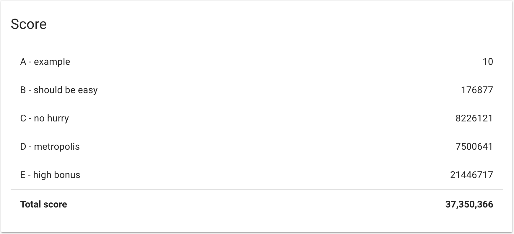
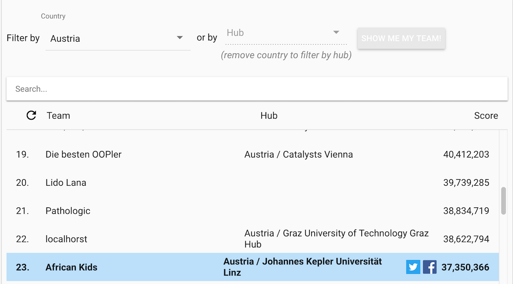
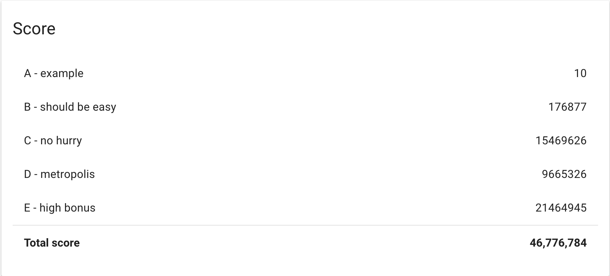

# Google Hashcode 2018

[Problem Statement](https://hashcodejudge.withgoogle.com/download/blob/AMIfv954N36SibZobYEpiIJZA3AyUuMEohUxq1yDh9KrVoMKoEWNaagPZptWMbEN_IDvpEQ6ZrUNFAXyzMAstttgtSkWxJJe8dEkXLz0BqgP0oQBcWZw49YnnY9wm3pxdz0l1wrVipuc9S1DjZKtEc8kqJnd-wX8zGYGxeBUt3WnFAZURIyU158HcujXfOvGOiVPLgZ8K9x4PTrLs4SFZZoCuT3_BKM0f-DHoo3gHOhiBi4lh8nGSel1HHiVTv_RAkRfz9hNuzR1q1g0vnngzvz364W2GWm16l4uGzFopmE1taAF2NI42_pOxgxNwQIxCBeo6J0VqKixhBE6BiO6rsYRy8Gm_m4gv9ALoerOXiaJMypmILG-XF1nPkin6SFKigPVDcywuVgB)

This is our teeam's Solution for Google's HashCode 2018 Qualification

[@Ramez](https://github.com/Ramez-), [@Nader](https://github.com/naderdavid)

## Our score on the live round (37,350,366):

## Ranking:

## Extended Round:
In the extended round we were able to get a score of (46,776,784) just by refactoring and organizing the code with almost the same logic 😭
I guess we had a bug somewhere that was fixed by refactroign.

## Algorithm:

Our algorithm iterates over the time steps and gets a list of available cars at each time step. For every car, it tries
to assign a ride by maximizing a scoring function over all available rides. It then updates the availability of that car to
the time step when it will complete its assigned ride.

The scoring function takes multiple factors into account e.g. ride distance, ride bonus, ride starting time.
